# 🏠 House Price Prediction with MLflow

<div align="center">

[](https://www.python.org/downloads/)
[](https://mlflow.org/)
[](https://scikit-learn.org/)
[](https://jupyter.org/)
[](https://opensource.org/licenses/MIT)
[]()
[](https://scikit-learn.org/stable/modules/ensemble.html#forest)
[](https://scikit-learn.org/stable/modules/grid_search.html)

*A comprehensive machine learning project for predicting California housing prices using Random Forest with MLflow experiment tracking*

</div>

---

## 📋 Table of Contents

- [🎯 Project Overview](#-project-overview)
- [✨ Features](#-features)
- [🔧 Technologies Used](#-technologies-used)
- [📊 Dataset](#-dataset)
- [🚀 Getting Started](#-getting-started)
- [📈 Model Performance](#-model-performance)
- [🔬 MLflow Experiment Tracking](#-mlflow-experiment-tracking)
- [📁 Project Structure](#-project-structure)
- [🎯 Usage Examples](#-usage-examples)
- [🔄 Workflow](#-workflow)
- [🤝 Contributing](#-contributing)
- [📄 License](#-license)

## 🎯 Project Overview

This project implements a **machine learning pipeline** for predicting house prices in California using the famous California Housing dataset. The project leverages **MLflow** for comprehensive experiment tracking, hyperparameter tuning, and model management, making it a production-ready ML solution.

### Key Highlights:
- 🔍 **Hyperparameter Optimization** using GridSearchCV
- 📊 **Experiment Tracking** with MLflow UI
- 🎯 **Model Registration** and versioning
- 📈 **Performance Monitoring** and comparison
- 🏗️ **Reproducible ML Pipeline**

## ✨ Features

- **Automated Hyperparameter Tuning**: Systematic optimization of Random Forest parameters
- **MLflow Integration**: Complete experiment lifecycle management
- **Model Comparison**: Easy comparison of different runs and parameters
- **Model Registry**: Centralized model versioning and deployment
- **Interactive Analysis**: Jupyter notebook for exploratory data analysis
- **Scalable Architecture**: Ready for production deployment

## 🔧 Technologies Used

| Technology | Purpose | Version |
|------------|---------|---------|
|  | Core Programming Language | 3.8+ |
|  | Experiment Tracking & Model Management | Latest |
|  | Machine Learning Framework | Latest |
|  | Data Manipulation | Latest |
|  | Interactive Development | Latest |

## 📊 Dataset

The project uses the **California Housing Dataset** from scikit-learn:

- **📈 Instances**: 20,640 housing districts
- **🔢 Features**: 8 numerical features
- **🎯 Target**: Median house value (in hundreds of thousands of dollars)
- **📅 Source**: 1990 U.S. Census data

### Features Description:
| Feature | Description |
|---------|-------------|
| `MedInc` | Median income in block group |
| `HouseAge` | Median house age in block group |
| `AveRooms` | Average number of rooms per household |
| `AveBedrms` | Average number of bedrooms per household |
| `Population` | Block group population |
| `AveOccup` | Average number of household members |
| `Latitude` | Block group latitude |
| `Longitude` | Block group longitude |

## 🚀 Getting Started

### Prerequisites

```bash
Python 3.8+
pip or conda package manager
```

### Installation

1. **Clone the repository**
   ```bash
   git clone https://github.com/yourusername/house-price-prediction.git
   cd house-price-prediction
   ```

2. **Create virtual environment**
   ```bash
   python -m venv venv
   
   # On Windows
   venv\Scripts\activate
   
   # On macOS/Linux
   source venv/bin/activate
   ```

3. **Install dependencies**
   ```bash
   pip install -r requirements.txt
   ```

4. **Start MLflow UI** (Optional)
   ```bash
   mlflow ui
   ```
   Access the UI at `http://localhost:5000`

5. **Run the notebook**
   ```bash
   jupyter notebook housepricepredict.ipynb
   ```

## 📈 Model Performance

The Random Forest model achieves excellent performance through systematic hyperparameter tuning:

### Hyperparameter Grid:
- **n_estimators**: [100, 200]
- **max_depth**: [5, 10, None]
- **min_samples_split**: [2, 5]
- **min_samples_leaf**: [1, 2]

### Evaluation Metrics:
- **Primary Metric**: Mean Squared Error (MSE)
- **Cross-Validation**: 3-fold CV for robust evaluation
- **Model Selection**: Best parameters based on lowest MSE

### Performance Highlights:
- 🎯 **Systematic Tuning**: 24 different parameter combinations tested
- 📊 **Cross-Validation**: 3-fold CV for robust model evaluation
- 🏆 **Best Model**: Automatically selected and registered in MLflow
- 📈 **Reproducible**: All experiments tracked and comparable

## 🔬 MLflow Experiment Tracking

### What's Tracked:
- ✅ **Parameters**: All hyperparameters for each run
- ✅ **Metrics**: MSE and other performance metrics
- ✅ **Models**: Trained models with metadata
- ✅ **Artifacts**: Model files and dependencies
- ✅ **Environment**: Python environment and package versions

### MLflow Features Used:
- **Experiment Tracking**: Log parameters, metrics, and models
- **Model Registry**: Version control for production models
- **Model Comparison**: Compare different runs side-by-side
- **Artifact Storage**: Store model files and metadata

## 📁 Project Structure

```
house-price-prediction/
├── 📊 housepricepredict.ipynb    # Main Jupyter notebook
├── 📋 requirements.txt           # Python dependencies
├── 📖 README.md                  # Project documentation
├── 🗂️ venv/                      # Virtual environment
├── 📈 mlruns/                    # MLflow experiment runs
│   └── 0/                        # Default experiment
│       ├── [run-id]/             # Individual run folders
│       └── models/               # Registered models
└── 🎯 mlartifacts/               # MLflow model artifacts
    └── 0/
        └── models/
            └── [model-id]/       # Model versions
```

## 🎯 Usage Examples

### Basic Model Training
```python
# Load and prepare data
housing = fetch_california_housing()
X_train, X_test, y_train, y_test = train_test_split(X, y, test_size=0.2)

# Start MLflow run
with mlflow.start_run():
    # Train model with hyperparameter tuning
    grid_search = hyperparameter_tuning(X_train, y_train, param_grid)
    
    # Log best parameters and metrics
    mlflow.log_param("best_n_estimators", grid_search.best_params_['n_estimators'])
    mlflow.log_metric("best_mse", mse)
    
    # Register model
    mlflow.sklearn.log_model(best_model, "best_model")
```

### Model Loading and Prediction
```python
# Load registered model
model = mlflow.sklearn.load_model("models:/Best random forest model/1")

# Make predictions
predictions = model.predict(X_new)
```

## 🔄 Workflow

```mermaid
graph TD
    A[📊 Load California Housing Data] --> B[🔧 Data Preprocessing]
    B --> C[✂️ Train-Test Split]
    C --> D[🎯 Define Hyperparameter Grid]
    D --> E[🔍 GridSearchCV with MLflow]
    E --> F[📈 Log Parameters & Metrics]
    F --> G[💾 Register Best Model]
    G --> H[📊 Compare Results in MLflow UI]
    H --> I[🚀 Deploy Model]
```



## 🤝 Contributing

Contributions are welcome! Please feel free to submit a Pull Request.

1. Fork the project
2. Create your feature branch (`git checkout -b feature/AmazingFeature`)
3. Commit your changes (`git commit -m 'Add some AmazingFeature'`)
4. Push to the branch (`git push origin feature/AmazingFeature`)
5. Open a Pull Request

## 🙏 Acknowledgments

- **scikit-learn** team for the California Housing dataset
- **MLflow** community for the excellent experiment tracking platform
- **Python** ecosystem for powerful ML libraries

---

<div align="center">

**⭐ Star this repository if you find it helpful!**

Made with ❤️ by [Your Name]

</div> 